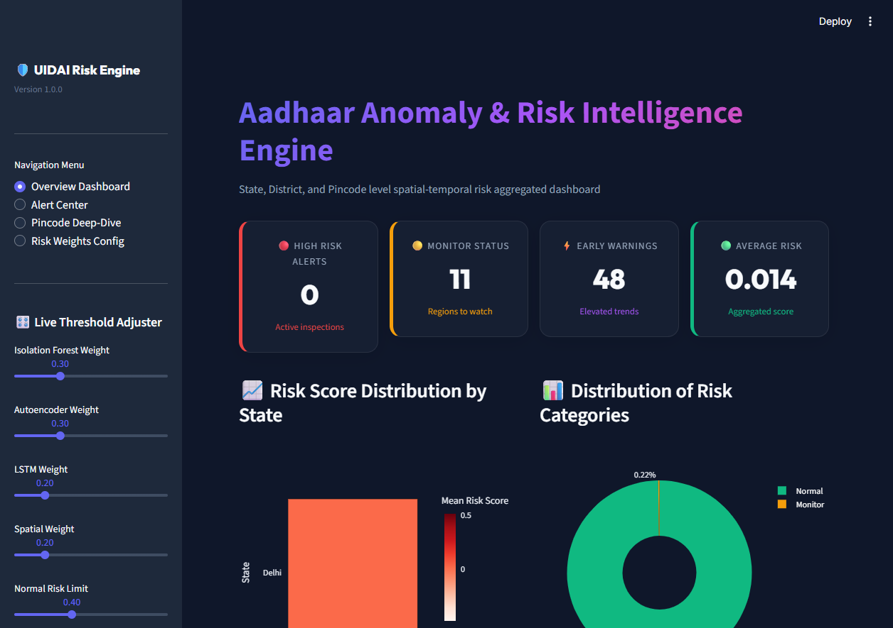
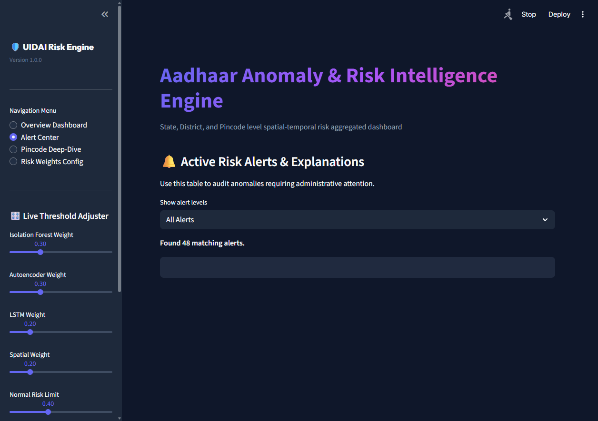
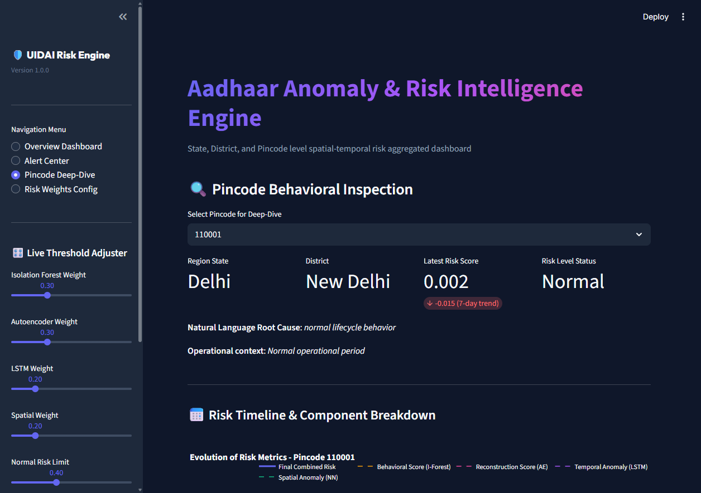
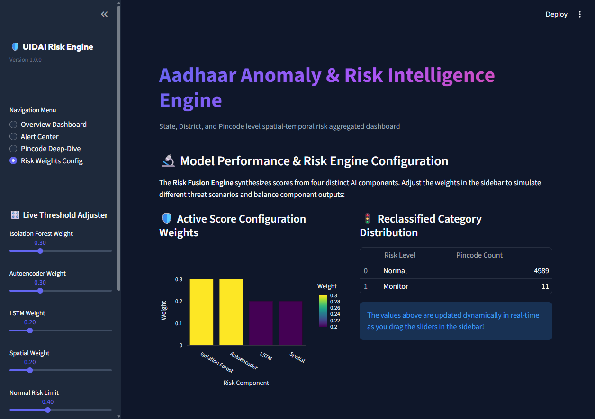
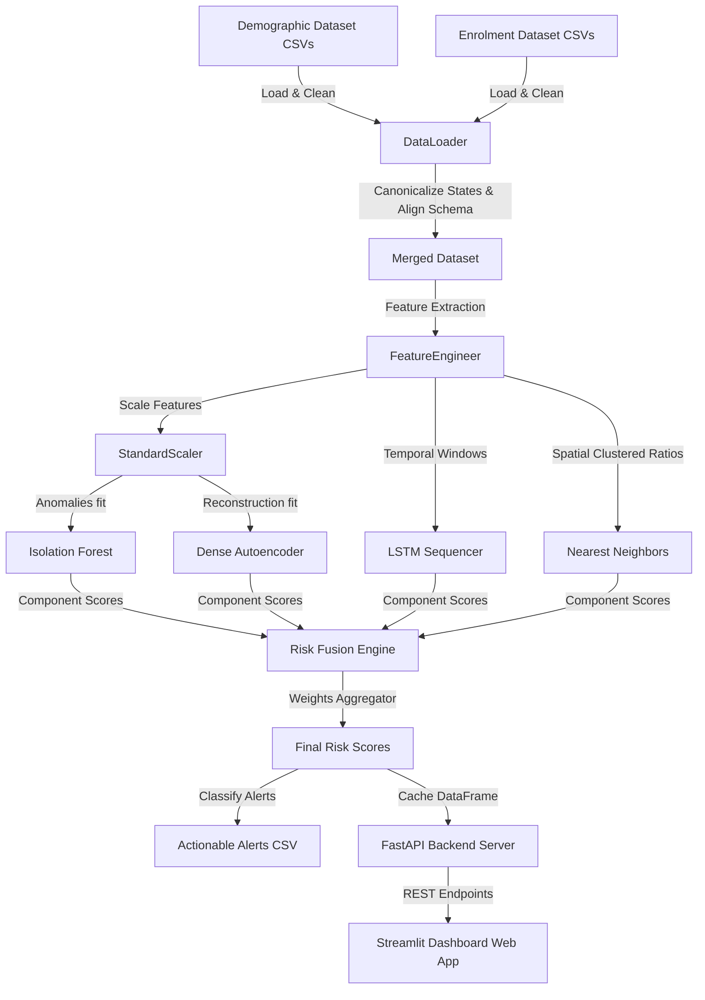

# 🛡️ UIDAI Aadhaar Risk Intelligence & Anomaly Detection System

[](https://www.python.org/)
[](https://streamlit.io/)
[](https://fastapi.tiangolo.com/)
[](https://www.tensorflow.org/)
[](https://www.docker.com/)
[](https://github.com/features/actions)
[](https://render.com/)
[](https://opensource.org/licenses/MIT)
[](https://github.com/sg721642/UIDAI-Aadhaar-Risk-Intelligence)

An AI-powered, production-grade risk intelligence system designed to analyze Aadhaar demographic and enrolment update patterns. By applying behavioral anomaly detection, temporal series forecasting, and spatial density aggregation, the system identifies regions (pincodes) exhibiting anomalies that may require closer administrative scrutiny.

---

## 🔗 Live Deployments

*   **Interactive Streamlit Dashboard:** [https://uidai-aadhaar-risk-intelligence-4w38qdtvkssagubcm48fjy.streamlit.app/](https://uidai-aadhaar-risk-intelligence-4w38qdtvkssagubcm48fjy.streamlit.app/)
*   **Production API Backend:** [https://uidai-aadhaar-risk-intelligence-api.onrender.com](https://uidai-aadhaar-risk-intelligence-api.onrender.com)
*   **API Swagger Documentation:** [https://uidai-aadhaar-risk-intelligence-api.onrender.com/docs](https://uidai-aadhaar-risk-intelligence-api.onrender.com/docs)

---

## 📌 Problem Statement

The integrity of national identity registry operations is crucial. Due to the high volume of demographic updates (name, date of birth, address) and biometric updates (photo, fingerprints, iris scans), manually identifying irregular update clusters or coordinate shift trends across India’s postal index numbers (pincodes) is infeasible. 

This system solves this challenge by implementing an automated **unsupervised and temporal machine learning pipeline** that processes aggregated update counts to detect irregular activity, identify spatial outliers, track risk evolution, and generate explainable security alerts—without storing or exposing individual Aadhaar numbers or PII.

---

## 📈 Features

*   **Privacy-First Design:** Operates entirely on aggregated count stats. No individual PII or Aadhaar numbers are collected, stored, or processed.
*   **Anomalous Pattern Spotting:** Combines an unsupervised **Isolation Forest** (out-of-distribution detection) and a **Dense Autoencoder** (reconstruction loss mismatch).
*   **Temporal Forecasting:** Uses an **LSTM Recurrent Neural Network** trained on temporal sequences to predict normal seasonal variations (e.g. school admissions) and separate them from persistent structural anomalies.
*   **Spatial Neighborhood Analysis:** Uses **Nearest Neighbors** to flag pincodes whose biometric-to-demographic update patterns diverge drastically from neighboring geographic zones.
*   **Risk Engine Weights Simulator:** Includes a dashboard configuration slider allowing admins to fine-tune model fusion weights dynamically.
*   **Explainable Security Alerts:** Translates numerical risk indicators into natural-language reasons for every flagged region.
*   **Production Decoupling:** Decoupled FastAPI backend and Streamlit dashboard ready for cloud autoscaling.

---

## 🎨 Screenshots

### 1. Overview Dashboard


### 2. Alert Center


### 3. Pincode Deep-Dive


### 4. Risk Weight Configuration


---

## 🏗️ System Architecture



Detailed technical specifications are available in the `docs/` directory:
*   [Architecture.md](docs/Architecture.md) — Multi-layered workflow description.
*   [Dataset.md](docs/Dataset.md) — Raw CSV schema layouts and canonical cleaning rules.
*   [Models.md](docs/Models.md) — ML component details and equations.
*   [API.md](docs/API.md) — Backend query endpoints reference.
*   [Deployment.md](docs/Deployment.md) — Docker & Cloud setups.

---

## 🤖 ML Pipeline & Risk Engine

The final risk score is computed using a weighted linear combination of the anomaly indicators:

$$FinalRiskScore = w_{if} \cdot IF + w_{ae} \cdot AE + w_{lstm} \cdot LSTM + w_{spatial} \cdot Spatial$$

Where default weights are set to:
*   **Isolation Forest ($w_{if}$ = 0.3)**: Detects global update count spikes.
*   **Autoencoder ($w_{ae}$ = 0.3)**: Captures age-bracket representation skews.
*   **LSTM Network ($w_{lstm}$ = 0.2)**: Flags sustained, cyclical temporal anomalies.
*   **Spatial Neighborhood ($w_{spatial}$ = 0.2)**: Flags pincodes differing from geographical neighbors.

| Risk Level | Range | Meaning & Action |
| :--- | :--- | :--- |
| **Normal** | $< 0.40$ | Regular lifecycle behavior; normal logs. |
| **Monitor** | $0.40 - 0.70$ | Elevated activity; requires passive tracking. |
| **High Risk** | $\geq 0.70$ | Structural discrepancy; flagged for audit inspection. |
| **Early Warning** | flag = 1 | 7-day risk score trend increases by $>0.15$ while currently under the High Risk limit. |

---

## 🛠️ Tech Stack

*   **Programming Language:** Python 3.10+
*   **Deep Learning:** TensorFlow (CPU edition)
*   **Machine Learning:** Scikit-Learn
*   **Web Services API:** FastAPI, Uvicorn
*   **Interactive Dashboard:** Streamlit, Plotly, Seaborn, Matplotlib
*   **CI/CD:** GitHub Actions (Automated PyTest & Linting)
*   **Deployment:** Docker, Render (API), Streamlit Community Cloud (Frontend)

---

## 📂 Folder Structure

```
UIDAI-PROJECT-main/
├── .github/
│   └── workflows/
│       └── ci.yml                # CI setup (flake8, pytest, coverage)
├── .streamlit/
│   └── config.toml               # Streamlit styling & theme overrides
├── config/
│   └── config.yaml               # Central settings (thresholds, weights)
├── data/
│   ├── raw/                      # Anonymized data (kept clean)
│   └── processed/                # Models output (risk scores, summary)
├── docs/
│   ├── screenshots/              # Dashboard screens
│   ├── Architecture.md           # Flow details
│   ├── Dataset.md                # Columns & Cleaning rules
│   ├── Models.md                 # Neural network descriptions
│   └── Deployment.md             # Production hosting guides
├── models/                       # Trained models (.joblib, .keras)
├── src/
│   ├── config.py                 # Central config loader
│   ├── data/
│   │   └── data_loader.py        # Loading, deduplication, & canonical cleaning
│   ├── features/
│   │   └── engineer.py           # Feature engineering & sequence prep
│   ├── models/
│   │   ├── train.py              # ML models training orchestration
│   │   └── predict.py            # Inference, trend computing, & alerts
│   ├── api/
│   │   └── app.py                # FastAPI endpoints & bootstrap data
│   └── utils/
│       └── logger.py             # Logging setup
├── app.py                        # Streamlit dashboard app
├── run_pipeline.py               # CLI runner to trigger ML training/inference
├── start_services.py             # Concurrent server script
├── tests/                        # PyTest test cases
├── Dockerfile                    # Containerization script
├── requirements.txt              # Minimal dashboard dependencies
└── requirements-backend.txt      # Full ML pipeline dependencies
```

---

## ⚙️ Installation & Local Development

### 1. Build Virtual Environment & Install Dependencies
```bash
python -m venv venv
# On Windows
venv\Scripts\activate
# On Unix/macOS
source venv/bin/activate

# Install dependencies
pip install -r requirements-backend.txt
```

### 2. Run Data Cleaning & Model Training
Execute the end-to-end pipeline CLI:
```bash
python run_pipeline.py --train
```

### 3. Launch API Backend & Dashboard Locally
Start the API and Dashboard concurrently:
```bash
python start_services.py
```
*   **FastAPI Endpoints**: Open `http://localhost:8081/docs` to test endpoints via Swagger.
*   **Interactive Dashboard**: Open `http://localhost:8501` to view the Streamlit UI.

---

## 🧪 Testing Suite
To verify the entire pipeline, run the test suites:
```bash
python -m pytest tests/ --tb=short
```

---

## 📝 License & Contribution

This project is distributed under the terms of the MIT License. Details can be found in the [LICENSE](LICENSE) file.

Contributions are welcome! Please feel free to open a Pull Request or issue for bugs, documentation improvements, or algorithm optimization proposals.

---

## 🧑‍💻 Author

**UIDAI Aadhaar Risk Intelligence System Development Team**
*   **GitHub:** [@sg721642](https://github.com/sg721642)
