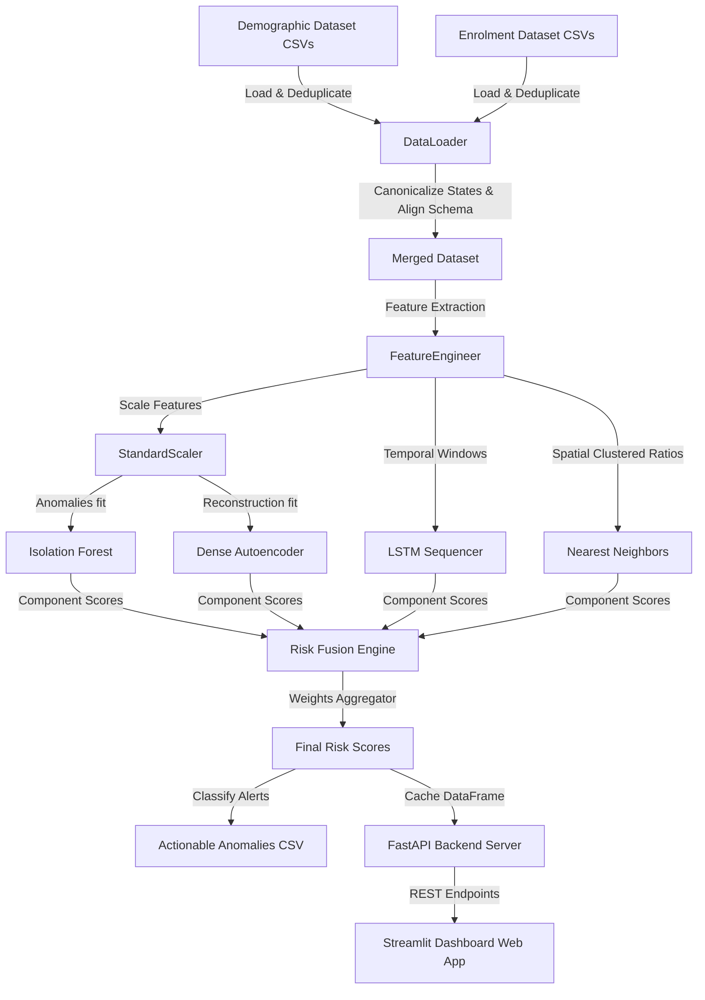

# System Architecture Specification

The system processes aggregated update data into actionable risk intelligence through a multi-layered decoupled pipeline.

## Architectural Layers

1. **Ingestion & Data Prep Layer**
   - **DataLoader**: Decouples reading and concatenating directory files. Removes duplicate entries, parses dates, canonicalizes 36 states, and maps enrolment to biometric data schemas.

2. **Feature Engineering Layer**
   - **FeatureEngineer**: Computes biometric-demographic ratios, age skews, and rolling statistics.

3. **Machine Learning Layer**
   - Includes **Isolation Forest**, **Dense Autoencoder**, **LSTM network**, and **Nearest Neighbors**. Checkpoints are saved under the `models/` directory for fast startup.

4. **Risk Aggregator & Interpretation Layer**
   - Combines component anomaly scores using weighted equations.
   - Enriches records with natural language explanations, semantic context, risk persistence trackers, risk trends, and simulation deviations.

5. **REST API Service Layer**
   - FastAPI server caching risk data in-memory to expose performant JSON endpoints.

6. **Presentation Layer**
   - Streamlit dashboard loading records dynamically. Incorporates Plotly timelines, density heatmaps, and sliders for real-time recalculations.
